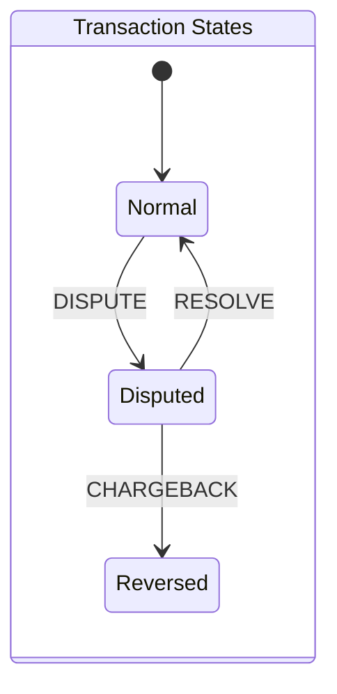

# Payments

A toy payments engine

## Assumptions:

* Representation of dollar values
  
  * With 4 decimal places precision on amounts, this implies 10k distinct steps per dollar - minimum resolvable amount is 0.0001 dollar
  
  * Assuming normal real world amounts - expect transactions to be less \$1 billion (\$1e9) - may need to revisit this assumption if inflation continues at current trends
  
  * This means we need to resolve steps: 1e9 * 1e4 = 1e13 - this can be represented in ceil(log2(1e13)) = 44 bits
  
  * This is less the mantissa for a 64-bit floating point number (55 bits) so we should be able to repesent this range accurately in that representation
  
  * If requirements dicatate a larger maximum transaction amount, switching to a fixed point representation (e.g u64 for dollar amount + u16 for decimal amount) would allow for accuracy over a wider range
  
  * Will be using `f64` for amount represenations for this project

* Dispute resolution operations (dispute, resolve, chargeback) can only occur on deposit or withdrawal operations
  
  * In the case of widthdrawals, the disupted amount has a negative magnitude

## Design considerations

* Because the dispute, resolve and chargeback operations don't store amounts, we need to be able to reference the originating deposit or withdrawal transactions at any time after creation
  
  * The current specification states the transaction ID is a u32 integer which implies 2^32 (~4 billion) records which is probably within the bounds of a single systems memory configuration (for development), but an obvious change to the system would be to make these transaction IDs opaque data blobs (say hashes) or u64 integers which would require a dedicated data store
  
  * A key-value or relational database could implement this, however we use a memory backed store with an abstracted inteface to allow simpler implementation during development with the option of changing out the repository implementation at some point in the future

* The CLI client is the driving application of the core entities business logic, however the service level interfaces should be set up for possible integration into a web gateway or as a consumer of a streaming feed (e.g. Kafka)

Test cases:

- dispute
  - on a tx that doesn't exist - noop
  - on a tx already under dispute
  - on a transaction where client_id doesn't match
- resolve
  - on a tx that doesn't exist - noop
  - on a tx not under dispute
- chargeback
  - on a tx that doesn't exist - noop
  - on an acount already frozen
- disputes work
  - on deposits
  - on withdrawals
  - account can be disputed multiple times if not locked
- Disputed amount takes account below zero
- deposits and withdrawals can't occur on a locked account