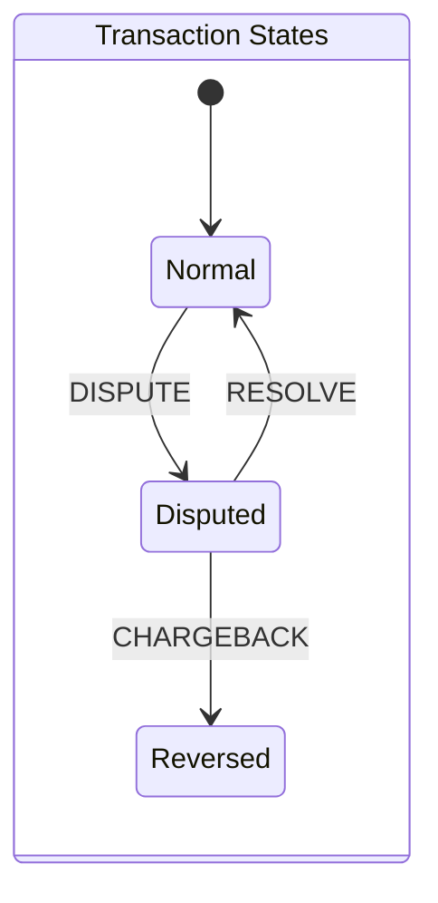

# Payments

A toy payments engine

## Assumptions:

* Deposit and Withdrawal transactions will always have a positive value in the `amount` field - deposit of a negative amount would just be a withdrawal

* Dispute resolution operations (dispute, resolve, chargeback) can only occur on deposit or withdrawal operations
  
  * In the case of withdrawals, the disputed amount has a negative magnitude

## Design considerations

* Representation of dollar values
  
  - This project uses fixed point representation implemented by upscaling values by a factor of 10,000, and transforming values to i128 integers
  
  - This provides the specified accuracy on transactions and allows for a maximum transaction (and account total) value of 3.4x10^34 which should be sufficient (may need to revisit depending on inflation trends)
  
  - Transformation at the output is via a f64 floating point representation which may truncate results, but could be fixed if it is a problem by output from the fixed point representation

- Because the dispute, resolve and chargeback operations don't store amounts, we need to be able to reference the originating deposit or withdrawal transactions at any time after creation
  
  * The current specification states the transaction ID is a `u32` integer which implies `2^32` (~4 billion) records which is probably within the bounds of a single systems memory configuration (for development), but an obvious change to the system would be to make these transaction IDs opaque data blobs (say hashes) or `u64` integers which would require a dedicated data store
  
  * A key-value or relational database could implement this, however we use a memory backed store with an abstracted interface to allow simpler implementation during development with the option of changing out the repository implementation at some point in the future

* The CLI client is the driving application of the core entities business logic, however the service level interfaces should be set up for possible integration into a web gateway or as a consumer of a streaming feed (e.g. Kafka)
  
  * Transactions processed at the service level should have observable outcomes in response to a request to process a transaction:
    
    1. Success - the transaction was processed normally
    
    2. Error - the transaction either:
       
       * Was ignored  - due to incorrect transaction-client specification
       
       * Failed - due to insufficient funds
    
    3. Panic - these indicate some fundamental system failure and should be caught and translated (e.g. 5xx HTTP status in the case of a web client)

## Transaction States

A key consideration of the system is the state of the transaction. This can be summarized by the following state transition diagram:

## Entities

The data storage interface should have storage for two record types:

1. **Transactions** - for tracking transaction status

2. **Accounts** - for tracking the account status

### Transaction Records

Transactions store the core data for a processed transaction (type, client_id, tx_id, amount), as well as the state of the transaction in response to dispute, resolve and chargeback operations.

There are two transaction types that result in immediate account changes (`deposit`, `withdrawal`), and three types that modify transaction state and modify accounts as a second order effect (`dispute`, `resolve`, `chargeback`). This means that we need to store `deposit` and `withdrawal` transactions as primary storage entities, and the processing of `dispute`, `resolve`, `chargeback` can update state on these entities.

The transaction record should have the following operational elements:

| Name        | Type  | Description                                                                                                                                                                                       |
| ----------- | ----- | ------------------------------------------------------------------------------------------------------------------------------------------------------------------------------------------------- |
| `tx_id`     | `u32` | ID of the transaction - unique primary key of the record set                                                                                                                                      |
| `tx_type`   | `u8`  | Enumeration of the transaction type encoded as an integer where: `0` = Deposit `1` = Withdrawal                                                                                           |
| `client_id` | `u16` |                                                                                                                                                                                                   |
| `amount`    | `f64` |                                                                                                                                                                                                   |
| `state`     | `u8`  | Enumeration of the transaction state where: `0` = Normal - undisputed or resolved transaction) `1` = Dispute - transaction is disputed `2` = Reversed - transaction has been reversed |

#### Transaction States

A key consideration of the system is the state of the transaction. This can be summarized by the following state transition diagram:

### Account Records

Account records store the state and total tallies of a client account as well as the locked state of the account. An account in locked state will reject any further transactional updates (deposit, withdraw, dispute, resolve and chargeback).

The state of the account must be considered during the processing of a transaction.

| Name        | Type   | Description                                                                                                       |
| ----------- | ------ | ----------------------------------------------------------------------------------------------------------------- |
| `client_id` | `u16`  | ID of the client account - unique primary key of the record set                                                   |
| `available` | `f64`  | Total funds available to transact of the account                                                                  |
| `held`      | `f64`  | Total funds held in dispute for the account                                                                       |
| `total`     | `f64`  | Total funds available or held for the account                                                                     |
| `locked`    | `bool` | State of the account - locked accounts will reject any further transactional state changes (i.e. any transaction) |

## Transaction Handling

There are 5 different transaction types.

### Deposit

A **deposit** will credit the client account which will increase the `available` amount (thus the `total` amount).

The client account does not need to exists prior to a deposit.

#### Preconditions

* the client account:
  
  * is not locked

### Withdrawal

A **withdrawal** will debit the client account decreasing the `available` amount (thus the `total` amount)

#### Preconditions

* the client account:
  
  * exists
  
  * is not locked
  
  * has sufficient funds (`available` >= transaction `amount`)

### Dispute

A **dispute** affects the client account by:

* reducing the `available` amount by the disputed transaction `amount`

This also sets the specified `transaction` into the `Disputed` state.

#### Preconditions

* the client account:
  
  * exists
  
  * is not locked

* the transaction specified:
  
  * exists
  
  * is in the `normal` state

### Resolve

A **resolve** affects the client account by:

* increasing the `available` amount by the specified transaction `amount`

* increasing the `held` amount by the same value

This also sets the specified `transaction` back into the `Normal` state.

#### Preconditions

* the client account:
  
  * exists
  
  * is not locked

* the transaction specified:
  
  * exists
  
  * is in the `Disputed` state

### Chargeback

A **chargeback** affects the client account by:

* decreasing the `available` amount by the specified transaction `amount`

* decreasing the `held` amount by the same value

* decreasing the `total` amount by the same value

Additionally, this sets the client account into the **locked** state.

This also sets the specified `transaction` into the `Reversed` state.

#### Preconditions

* the client account:
  
  * exists
  
  * is not locked

* the transaction specified:
  
  * exists
  
  * is in the `disputed` state

## Testing Notes

The majority of the testing is in the form of integration test. I currently don't have enough of a handle on the state of Rust mocking libraries to be able to mock out dependencies for testing.